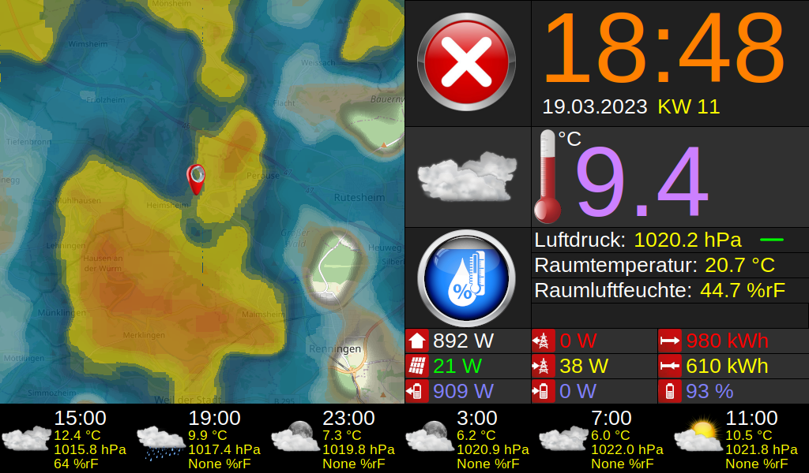

# Weather Clock v2.0 for Raspberry PI
This project is a dashboard with a Raspberry Pi to display weather data, rain radar, weather forecast, home automation data, etc. on a connected LCD written in Python. The grafical user interface (GIU) is diplayed in so called kiosk mode (no mouse cursor, no window bars, etc.). The data is collected from a local MQTT broker but also from Internet servers providing map data, weather forecast data, rain radar, etc. The rain radar supports actually only radar data from DWD (Deutscher Wetter Dienst).

## Display
I use a 7 inch IPS Waveshare display with 1024x600 pixels physical resolution, to which I adjusted the geometry of the weather clock GUI. It has and HDMI input and a low power consumption of only 1-2 Watt which is perfect for running 24/7. The power supply happens over the pin header of the Raspberry Pi. Detailed installation instructions you can find on the following Wiki page:

https://www.waveshare.com/wiki/7inch_HDMI_LCD

## Raspberry Pi
For version v2.0 I spent an upgrade because the radar overlay requires significantly more computing power: the Raspberry Pi 2 Zero W with its Quad-core ARMv8, but still with a low power consumption and an HDMI connector. Also it is possible to connect it directly to the backside of the Waveshare display. Only an additional mini-HDMI (type C) to normal-HDMI (type A) cable is required. The whole system (RPI + display) can be powered over the USB connector and consumes in total a maximum of only 5 Watt.

## Human Presence Sensor

For version v2.0 I also spent an upgrade for the radar sensor because the previously used RCWL-0516 interfered a lot with the Wi-Fi frequencies and caused many false positive triggers: the **LD2410C** human presense sensor module, whose radar frequency operates much higher at 24 GHz, is used to switch off the backlight when no motion of human bodies has been detected for the last 5 minutes. This is mainly for saving energy when nobody is in the room to watch the dashboard. The backlight is switched on automatically when motion is detected. The **OUT-pin** of the module is connected to the **GPIO 16** of the Raspberry Pi. Configuration of the sensivity of this radar module can easily be done per Bluetooth (BLE).

## Software on the Raspberry Pi
* Use at least a **16 Gbyte SD card** and install the latest Raspberry Pi OS (arm64, trixie, not the Lite version) on it. Use the Raspberry Pi Imager for a quick and easy way to install the SD card.
* Configure the graphics driver and resolution as described on https://www.waveshare.com/wiki/7inch_HDMI_LCD
* Configure preferable a static IP within your Wi-Fi network
* Activate **SSH** for remote configuration, SW update and maintainance
* Configure autostart of the weather clock script by creating a **.desktop** file

### Install following packages used by the Python script:
* Python 3 is typically installed already with version 3.15.x, so no need to upgrade this
* sudo apt update
* sudo apt install -y python3-h5py
* sudo apt install -y python3-matplotlib
* sudo apt install -y python3-pyproj
* sudo apt install -y python3-paho-mqtt

## Weather Clock configuration
### Please change following variables according to your location and your preferred wishes.
* longitude = "8.862"
* latiude  = "48.806"
* timezone = "Europe/Berlin"
* zoom = 11   [8...12]
* radar_background = "esri_topo" ["esri_topo"|"esri_satellite"|"esri_street"|"osm"|"grid"|"topographic"|"simple"]

The radar background (map) is downloaded as tiles in the desired zoom level when the weatherclock script is started the very first time. The tiles are stored in a tile cache and are loaded from there for all subsequent startups and draw updates of the rain radar. Only if there is a change to above listed configuration variables the background tiles need to be downloaded and cached again. This cache mechanism reduces internet traffic to a minimum.

### Please change following variables according to your MQTT settings:
* mqtt_user = "*********"
* mqtt_password = "***************"
* mqtt_broker_address = "192.168.xxx.xxx"
* mqtt_port = 1883
* mqtt_topic_pressure = "/483fdabaceba/pressure"
* mqtt_topic_outtemperature = "/483fdabaceba/temperature"
* mqtt_topic_outhumidity = "/483fdabaceba/humidity"
* mqtt_topic_intemperature = "/483fdabaceba/temperature"
* mqtt_topic_inhumidity = "/483fdabaceba/humidity"
* mqtt_topic_staticiaq = "/483fdaaaceba/staticiaq"
* mqtt_topic_ppurchase = "/00d0935D9eb9/ppurchase"
* mqtt_topic_pfeed = "/00d0935D9eb9/pfeed"
* mqtt_topic_pconsume = "/00d0935D9eb9/pconsume"
* mqtt_topic_pgenerate = "/00d0935D9eb9/pgenerate"
* mqtt_topic_pdischarge = "/00d0935D9eb9/pdischarge"
* mqtt_topic_pcharge = "/00d0935D9eb9/pcharge"
* mqtt_topic_sbatcharge = "/00d0935D9eb9/sbatcharge"
* mqtt_topic_eyield = "/00d0935D9eb9/eyield"
* mqtt_topic_eabsorb = "/00d0935D9eb9/eabsorb"

Hint: *You can deactivate the drawing of a widget if you don't need it by commenting out the responsible draw method. Feel free to implement your own widget.*

## Internet services used
* Tiles for the map background from Openstreetmap: e.g. https://tile.openstreetmap.org/{z}/{x}/{y}.png
* Tiles for the map background from Esri: e.g. https://services.arcgisonline.com/ArcGIS/rest/services/World_Imagery/MapServer/tile/{z}/{y}/{x}, https://services.arcgisonline.com/ArcGIS/rest/services/World_Topo_Map/MapServer/tile/{z}/{y}/{x}, https://services.arcgisonline.com/ArcGIS/rest/services/World_Street_Map/MapServer/tile/{z}/{y}/{x}
* DWD HX radar composite: https://opendata.dwd.de/weather/radar/composite/hx/composite_hx_LATEST-hd5
* Actual weather and weather forecast from BrightSky (DWD open weather data): e.g. https://api.brightsky.dev/weather?lat=48.80&lon=8.90&date=2021-10-18&tz=Europe/Berlin

## The program
Because rain radar processing and projection on a map background became with v2.0 much more complex as just downloading rain radar tiles from a tile server like from RainViewer, I decided to implement this stuff in a separate class in file **RadarProcessor.py**. The class is limited actually to support only DWD radar data, means covering only Germany. It uses the DWD HX radar composite product in HDF5 format, where the reflectivity is measured in dBZ and which is updated every 5 minutes. Also the class supports features like:
* different map backgrounds
* cities overlay
* download only on new radar data (typically every 5 minutes)
* original HX radar dBZ colors
* heatmap gaussian filtering for smooth antialzed rain radar visualization
* using exact projection which comes with DWD radar data
* tile caching, to reduce the traffic with map servers to a minimum

Also **weatherclock_rpi.py** itself has been improved to solve some known bugs, e.g. a flickering issue which was frequently observed when widgets were updated/redrawn and MQTT stability/reconnection. The support for downloading tiles from RainViewer has been replaced by downloading and processing rain radar data from DWD.

Execute the script (for running on a Raspberry Pi) with: **python3 ./weatherclock_rpi.py**

Execute following script for running the weather clock on a PC under Linux or Windows: **python3 ./weatherclock_pc.py**

To test the rain radar stand-alone you can execute: **python3 ./rain.py**
